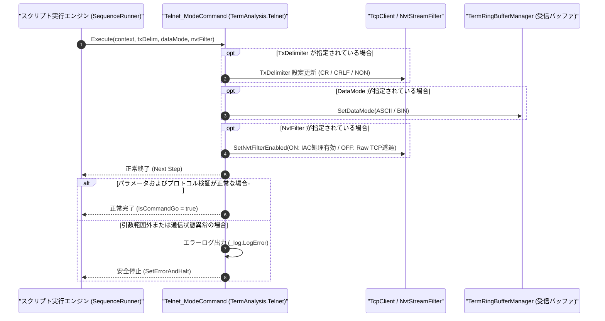

# コマンドリファレンス：Telnet_Mode

## 概要

**Telnet_Mode** は、Telnet（および Raw TCP ソケット）通信における送信デリミタ（`TXCR` / `TXCRLF` / `NON`）、受信データモード（`ASCII` / `BIN`）、および Telnet NVT 制御コード（IAC: `0xFF`）のフィルタ・自動ネゴシエーション応答の有効／無効（`ON` / `OFF`）を設定する統合モード制御コマンドです。

> 💡 **補足**: 第 3 引数 `NvtFilter` を `ON` にすると標準 Telnet サーバー（ルーターや Linux ホスト等）とのネゴシエーションを行い、`OFF` にすると `0xFF` を含む任意のバイナリフレームを透過させる Raw TCP ソケット通信として機能します。

---

## 💡 書式・パラメータ仕様

### コマンド構文

```csv
,SEQUENCE, [ステップキー], Telnet_Mode, "[TxDelimiter]", "[DataMode]", "[NvtFilter: ON/OFF]"
```

### パラメータ（引数）一覧

| 引数位置 | パラメータ名 | 必須/任意 | 型・制約 | 説明 |
| :---: | :--- | :---: | :--- | :--- |
| 第1引数 | `TxDelimiter` | 任意 | `TXCR` / `TXCRLF` / `TXLF` / `NON` | `Telnet_Send` 等で自動付与する送信末改行コードを指定します。空文字 `""` または省略時は現在値を維持します。 |
| 第2引数 | `DataMode` | 任意 | `ASCII` / `BIN` | 受信リングバッファおよびログの解釈モード（テキスト行解析／バイナリストリーム）を指定します。 |
| 第3引数 | `NvtFilter` | 任意 | `ON` / `OFF`（既定値: `ON`） | Telnet NVT プロトコル（IAC `0xFF` 制御シーケンス）の分離・自動応答を行うか（`ON`）、Raw TCP ソケットとして全バイトをそのまま透過させるか（`OFF`）を指定します。 |

---

## 🔄 特殊置換規約・分岐規約の適用

本コマンドの引数における特殊記法および解釈ルールです。
* **動的置換（`$`）**: 引数内で `$PARAMキー$` のように記述すると、実行時に変数プール（PARAM）の値へ動的置換されます。（適用可能な引数: 全引数対応）
* **ジャンプ先指定（`#`）**: 本コマンドはジャンプ制御を行わないため適用されません。（適用可能な引数: 非適用）
* **共通コマンド指定（`@`）**: 本コマンドは外部マクロを呼び出さないため、共通コマンド呼び出し記法は適用されません。（適用可能な引数: 非適用）
* **カンマのエスケープ**: 通信条件文字列（例: `"9600,E,7,1"`）や複数データのカンマ区切り値を単一引数として渡す場合は、必ず `"..."` と二重引用符で囲んで記述します。
* **エイリアス（別名）**: `Telnet_Ip`, `Analysis_Telnet_Ip`

---

## 💡 動作例（正しい構文での記述例）

### スクリプト記述例

※COMMAND ブロック配下の子要素行（PARAM, SEQUENCE）は必ず行頭カンマから開始し、スペースインデントや行末コメント（`;`）は記述しないでください。

```csv
COMMAND, "SAMPLE_TELNET_MODE", ""
; 1. 標準Telnet接続向け設定（CRLF改行、ASCIIモード、NVT IACフィルタ有効）
,SEQUENCE, 010, Telnet_Mode, "TXCRLF", "ASCII", "ON"
,SEQUENCE, 020, Telnet_Open
,SEQUENCE, 030, Telnet_Close
; 2. Raw TCPソケット機器（バイナリプロトコル）向け設定（改行なし、BINモード、NVTフィルタ無効）
,SEQUENCE, 040, Telnet_Mode, "NON", "BIN", "OFF"
,SEQUENCE, 050, Telnet_Open
,SEQUENCE, 060, Telnet_Send, "02 01 FF 03", "HEX"
,SEQUENCE, 070, Telnet_Close
,SEQUENCE, 080, Exit
```

### 実行時の挙動・変数変化

* **実行前の状態**: Term 通信エンジンが初期化され、必要な通信パラメータおよび変数プール（`PARAM`）が準備されている状態。
* **実行後の状態**: 1 回目の `Telnet_Mode` では標準 Telnet クライアントとして動作し、サーバーからの `IAC DO/WILL` ネゴシエーションを自動処理してテキストのみを受信バッファへ格納します。 2 回目の `Telnet_Mode` では `NvtFilter` が `OFF` になるため、ペイロード内の `0xFF` バイトが Telnet 制御コードとして誤認・除去されることなく、そのまま Raw TCP ストリームとして送受信されます。

---

## 🔄 動作フロー（シーケンス図）


```mermaid
sequenceDiagram
    autonumber
    participant Script as "スクリプト実行エンジン (SequenceRunner)"
    participant Cmd as "Telnet_ModeCommand (TermAnalysis.Telnet)"
    participant Sock as "TcpClient / NvtStreamFilter"
    participant Buf as "TermRingBufferManager (受信バッファ)"

    Script->>Cmd: Execute(context, txDelim, dataMode, nvtFilter)
    opt TxDelimiter が指定されている場合
        Cmd->>Sock: TxDelimiter 設定更新 (CR / CRLF / NON)
    end
    opt DataMode が指定されている場合
        Cmd->>Buf: SetDataMode(ASCII / BIN)
    end
    opt NvtFilter が指定されている場合
        Cmd->>Sock: SetNvtFilterEnabled(ON: IAC処理有効 / OFF: Raw TCP透過)
    end
    Cmd-->>Script: 正常終了 (Next Step)
    alt パラメータおよびプロトコル検証が正常な場合
        Cmd-->>Script: 正常完了 (IsCommandGo = true)
    else 引数範囲外または通信状態異常の場合
        Cmd->>Cmd: エラーログ出力 (_log.LogError)
        Cmd-->>Script: 安全停止 (SetErrorAndHalt)
    end
```

---

## 🚫 エラーハンドリング・安全設計（仕様制限）

1. **未定義キーワードの検証**:
   - `TxDelimiter` に `TXCR`/`TXCRLF`/`TXLF`/`NON` 以外、または `NvtFilter` に `ON`/`OFF`（`TRUE`/`FALSE`, `1`/`0` 含む）以外の不正な文字列が指定された場合は、`ArgumentException` を送出します。
2. **BIN モードと NVT フィルタの整合性保護**:
   - バイナリ通信時に `0xFF` が欠落する事故を防ぐため、`BIN` モード選択時には `NvtFilter` を `OFF` にすることが推奨されます。

---

## 🧪 ユニットテスト仕様

本コマンドクラス（`Telnet_ModeCommand.cs`）に実装されている `RunUnitTest()` メソッドが検証するユニットテストの仕様です。

### テスト実行前提条件

* **実行トリガー**: `RunUnitTest()` メソッドの呼び出し
* **有効化条件**: システム全体の最小ログレベル（`ErrorLogger.MinimumLevel`）が `LogLevel.Test` であること（それ以外の場合は無効化ガードにより早期リターン）
* **検証結果出力**: `_log.LogTest` によるログ出力。検証失敗時は `_log.LogError`、予期せぬ例外発生時は `_log.LogCritical` で記録し、`finally` ブロックで `ApplyTelnetSetting` により `"TXDELIMITER"`=`"TXCR"`、`"DATAMODE"`=`"ASCII"`、`"NVTFILTER"`=`"ON"` へ初期状態を復元します。

### テストケース一覧

| No | テストカテゴリ | テスト条件（入力値） | 期待される結果（出力値） | 検証の目的 / 観点 |
| :---: | :--- | :--- | :--- | :--- |
| **1** | 正常系 | 引数 `"TXCRLF"`, `"BIN"`, `"OFF"` の 3 引数を一括指定して実行 | `!param.HasError` かつ `TxDelimiter == TermTxDelimiterMode.TXCRLF`、`DataMode == TermDataMode.BIN`、`!NvtFilterEnabled` となる | 送信デリミタ・バイナリ受信モード・NVT フィルタ無効化（Raw TCP 透過）の一括設定検証 |
| **2** | 異常系 | 引数 4 個以上の過剰指定（`ValidateParamRange(0, 3)` 違反）または設定適用中の例外発生 | 引数範囲外エラー出力による早期リターン、または `_log.LogCritical` 記録と `SetErrorAndHalt(-1, ex.Message)` による安全停止 | 引数個数境界ガードおよびモード更新例外時のフェイルセーフ検証 |
