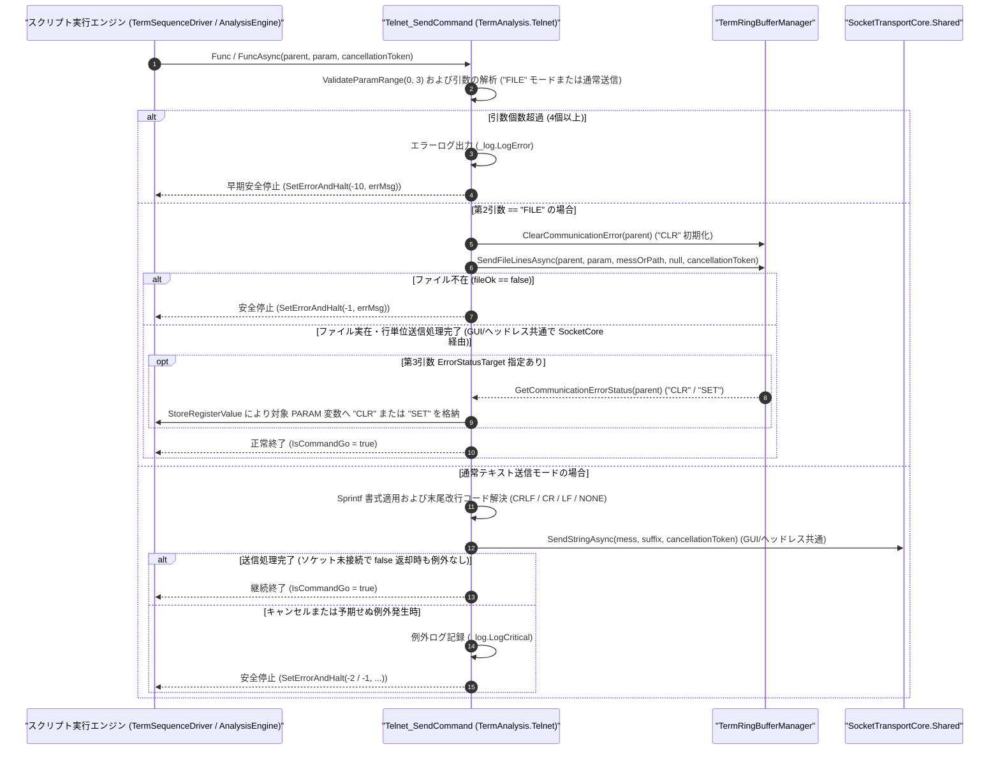

# コマンドリファレンス：Telnet_Send

## 概要

**Telnet_Send** は、接続中の Telnet（または Raw TCP ソケット）ストリームに対してテキスト電文（`Sprintf` 書式整形・改行コード制御対応）または指定ファイルの内容を送信するコマンドです。
第 2 引数に `"FILE"` を指定した場合は、ファイル内の各行を送信した上で、通信エラー状態（`"CLR"`: 正常 / `"SET"`: エラー発生）を第 3 引数の指定変数へ書き戻します。

> 💡 **補足** : 通常送信で改行指定を省略した場合は、`Telnet_Mode` または UI プロパティ画面で設定された送信デリミタ（`TXCR` / `TXCRLF` / `NON`）が送信データ末尾に自動付与されます。

---

## 💡 書式・パラメータ仕様

### コマンド構文

```csv
; 1. 通常テキスト送信モード（0〜3 引数）
,SEQUENCE, [ステップキー], Telnet_Send, "[Message]", "[SprintfFormatOrLineEnding]", "[LineEnding]"

; 2. ファイル送信・通信エラー確認モード（第 2 引数 "FILE"）
,SEQUENCE, [ステップキー], Telnet_Send, "<FilePath>", "FILE", "[ErrorStatusTarget]"
```

### パラメータ（引数）一覧

| 引数位置 | パラメータ名 | 必須/任意 | 型・制約 | 説明 |
| :---: | :--- | :---: | :--- | :--- |
| 第1引数 | `Message` / `FilePath` | 任意（ファイル送信時は必須） | 文字列 | 送信するテキスト文字列（省略時は空文字＋改行のみ送信）、または `"FILE"` モード時の対象テキストファイルパスを指定します。 |
| 第2引数 | `Format` / `Mode` | 任意 | 書式文字列 / 改行コード / `"FILE"` | ・`"FILE"` 指定時：第 1 引数をファイルパスとして読み込み行単位で送信します。<br>・通常送信時：`Sprintf` 書式文字列（例: `"SET_CH %02d"`）を指定して第 1 引数を整形します。なお第 3 引数省略時に `"CRLF"` / `"CR"` / `"LF"` / `"NONE"`（`"NON"`）を指定した場合は改行指定として解釈されます。 |
| 第3引数 | `LineEnding` / `ErrorStatusTarget` | 任意 | 改行指定 / 格納先 PARAM キー | ・通常送信時：末尾改行コード（`"CRLF"` / `"TXCRLF"`, `"CR"` / `"TXCR"`, `"LF"`, `"NONE"` / `"NON"`）を個別指定します。<br>・`"FILE"` 指定時：送信後の通信エラー監視結果（`"CLR"`: 正常 / `"SET"`: エラー発生）を書き戻す変数キー名（`$` なし）を指定します。 |

---

## 🔄 特殊置換規約・分岐規約の適用

本コマンドの引数における特殊記法および解釈ルールです。
* **動的置換（`$`）** : 引数内で `$PARAMキー$` のように記述すると、実行時に変数プール（PARAM）の値へ動的置換されます。（適用可能な引数: 入力値となる引数。ただしエラー結果格納先キーには `$` を付けず変数名そのものを指定します）
* **ジャンプ先指定（`#`）** : 本コマンドはジャンプ制御を行わないため適用されません。（適用可能な引数: 非適用）
* **共通コマンド指定（`@`）** : 本コマンドは外部マクロを呼び出さないため、共通コマンド呼び出し記法は適用されません。（適用可能な引数: 非適用）
* **カンマのエスケープ** : 通信条件文字列（例: `"9600,E,7,1"`）や複数データのカンマ区切り値を単一引数として渡す場合は、必ず `"..."` と二重引用符で囲んで記述します。
* **エイリアス（別名）** : なし（標準コマンド名 `Telnet_Send` のみ。大文字・小文字は区別されません）

---

## 💡 動作例（正しい構文での記述例）

### スクリプト記述例

※COMMAND ブロック配下の子要素行（PARAM, SEQUENCE）は必ず行頭カンマから開始し、スペースインデントや行末コメント（`;`）は記述しないでください。

```csv
COMMAND, "SAMPLE_TELNET_SEND", ""
,PARAM, "TARGET_IP_CMD", Text, "送信コマンド", "show ip interface brief"
,PARAM, "TX_ERR", Work, "通信エラー状態", ""
,SEQUENCE, 005, Telnet_Open
; 1. 変数展開を含むTelnetコマンド送信（Telnet_Mode / UI設定の改行コードを自動付与）
,SEQUENCE, 010, Telnet_Send, "$TARGET_IP_CMD$"
; 2. 改行コード CRLF を明示指定してコマンド送信
,SEQUENCE, 020, Telnet_Send, "terminal length 0", "", "CRLF"
; 3. ファイル送信と通信エラー状態（"CLR" / "SET"）の取得・判定
,SEQUENCE, 030, Telnet_Send, ".\scripts\acl_list.txt", "FILE", "TX_ERR"
,SEQUENCE, 040, Judge, EQU, "$TX_ERR$", "CLR", #SOCKET_ERR_HANDLER#
,SEQUENCE, 050, Telnet_Close
,SEQUENCE, 060, Exit
; ソケット送信エラー検出時のハンドラ
,SEQUENCE, #SOCKET_ERR_HANDLER#, Msg_Box, "ファイル送信中にソケット通信エラー（$TX_ERR$）を検出しました"
,SEQUENCE, 070, Telnet_Close
,SEQUENCE, 080, Exit
```

### 実行時の挙動・変数変化

* **実行前の状態** : Term 通信エンジンが初期化され、必要な通信パラメータおよび変数プール（`PARAM`）が準備されている状態。
* **実行後の状態** : 1 回目の `Telnet_Send` では `"show ip interface brief"` に既定の送信デリミタが付与されて TCP ストリームへ送出されます。 2 回目の `Telnet_Send` では `"terminal length 0\r\n"` が送信されます。 3 回目の `Telnet_Send`（`"FILE"` モード）では `.\scripts\acl_list.txt` の各行が送信され、通信エラーが発生していなければ変数 `TX_ERR` に `"CLR"`（エラー発生時は `"SET"`）が格納されます。

---

## 🔄 動作フロー（シーケンス図）


```mermaid
sequenceDiagram
    autonumber
    participant Script as "スクリプト実行エンジン (TermSequenceDriver / AnalysisEngine)"
    participant Cmd as "Telnet_SendCommand (TermAnalysis.Telnet)"
    participant Buf as "TermRingBufferManager"
    participant Sock as "SocketTransportCore.Shared"

    Script->>Cmd: Func / FuncAsync(parent, param, cancellationToken)
    Cmd->>Cmd: ValidateParamRange(0, 3) および引数の解析 ("FILE" モードまたは通常送信)
    alt 引数個数超過 (4個以上)
        Cmd->>Cmd: エラーログ出力 (_log.LogError)
        Cmd-->>Script: 早期安全停止 (SetErrorAndHalt(-10, errMsg))
    else 第2引数 == "FILE" の場合
        Cmd->>Buf: ClearCommunicationError(parent) ("CLR" 初期化)
        Cmd->>Buf: SendFileLinesAsync(parent, param, messOrPath, null, cancellationToken)
        alt ファイル不在 (fileOk == false)
            Cmd-->>Script: 安全停止 (SetErrorAndHalt(-1, errMsg))
        else ファイル実在・行単位送信処理完了 (GUI/ヘッドレス共通で SocketCore 経由)
            opt 第3引数 ErrorStatusTarget 指定あり
                Buf-->>Cmd: GetCommunicationErrorStatus(parent) ("CLR" / "SET")
                Cmd->>Script: StoreRegisterValue により対象 PARAM 変数へ "CLR" または "SET" を格納
            end
            Cmd-->>Script: 正常終了 (IsCommandGo = true)
        end
    else 通常テキスト送信モードの場合
        Cmd->>Cmd: Sprintf 書式適用および末尾改行コード解決 (CRLF / CR / LF / NONE)
        Cmd->>Sock: SendStringAsync(mess, suffix, cancellationToken) (GUI/ヘッドレス共通)
        alt 送信処理完了 (ソケット未接続で false 返却時も例外なし)
            Cmd-->>Script: 継続終了 (IsCommandGo = true)
        else キャンセルまたは予期せぬ例外発生時
            Cmd->>Cmd: 例外ログ記録 (_log.LogCritical)
            Cmd-->>Script: 安全停止 (SetErrorAndHalt(-2 / -1, ...))
        end
    end
```

---

## 🚫 エラーハンドリング・安全設計（仕様制限）

1. **引数超過・ファイル不在・キャンセル時の安全停止と通常送信時の未接続継続仕様** :
   - 4 個以上の引数が指定された場合は `ValidateParamRange(0, 3)` によりエラーコード **`-10`** で早期安全停止し、`"FILE"` モードで指定ファイルが存在しない場合は `SetErrorAndHalt(-1, ...)` で安全に停止します（キャンセル要求時は `-2`、予期せぬ例外発生時は `-1` で停止）。一方、GUI 接続時・ヘッドレス実行時ともに `SocketTransportCore.Shared.SendStringAsync` を直接呼び出して送信を行い、通常送信モードでソケット未接続等により下位送信が `false` を返した場合は例外を送出せず `IsCommandGo = true` で次ステップへ継続します（後続の `Telnet_WaitPrompt` 等でタイムアウト検知可能です）。
2. **通信エラー状態の初期化と記録** :
   - `"FILE"` モード実行時は送信開始前に通信エラーフラグを `"CLR"` にクリアし、送信中にソケット異常が発生した場合は `"SET"` を指定変数へ記録します（16 進文字列を変換する `"HEX"` モードは本コマンドには存在しません）。

---

## 🧪 ユニットテスト仕様

本コマンドクラス（`Telnet_SendCommand.cs`）に実装されている `RunUnitTest()` メソッドが検証するユニットテストの仕様です。

### テスト実行前提条件

* **実行トリガー** : `RunUnitTest()` メソッドの呼び出し
* **有効化条件** : システム全体の最小ログレベル（`ErrorLogger.MinimumLevel`）が `LogLevel.Test` であること（それ以外の場合は無効化ガードにより早期リターン）
* **検証結果出力** : `_log.LogTest` によるログ出力。検証失敗時は `_log.LogError`、予期せぬ例外発生時は `_log.LogCritical` で記録し、`finally` ブロックで `SocketTransportCore.Shared.Disconnect()` および `SocketTransportCore.Shared.IsSimulationMode` の復元を実行します。

### テストケース一覧

| No | テストカテゴリ | テスト条件（入力値） | 期待される結果（出力値） | 検証の目的 / 観点 |
| :---: | :--- | :--- | :--- | :--- |
| **1** | 正常系 | `IsSimulationMode = true` で `Connect("127.0.0.1", 23)` 接続後、引数 `"uname -a"`, `""`, `"CRLF"` を指定して実行 | `!param.HasError` かつ送信データ `param.SndData` が `"uname -a\r\n"` と一致する | コマンド文字列への終端改行（`CRLF`）付与および Telnet ソケット送信の検証 |
| **2** | 異常系 | 過剰引数 4 個（`"ls"`, `""`, `"CRLF"`, `"EXTRA_INVALID"`）を指定して `Func(null, invalidParam)` を実行（`ValidateParamRange(0, 3)` 違反） | `invalidParam.HasError == true` かつ `!invalidParam.IsCommandGo` で安全に実行拒否・停止する | 引数上限（最大 3 個）の境界ガード検証 |
